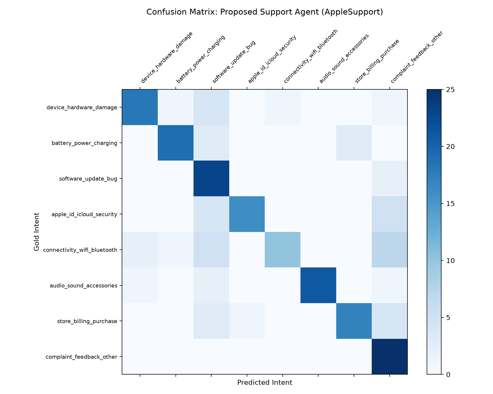
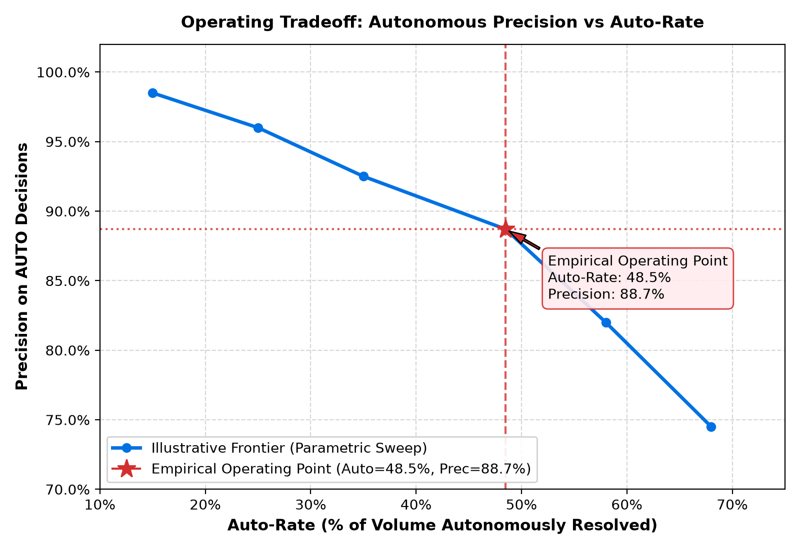

# AI Customer Support Agent for AppleSupport
### Hiver SDE Intern Take-Home Assignment

An AI-powered customer support system that classifies incoming customer queries into data-derived intents, retrieves grounded historical resolutions, drafts contextual replies, and executes hybrid autonomous/escalation routing.

Built for **@AppleSupport** (selected based on empirical resolution density across ~2.8M customer support tweets).

---

## Headline Results

Evaluated across a hand-calibrated **200-example Golden Evaluation Set** (25 real examples per category across all 8 taxonomy intents, extracted from genuine Kaggle TWCS AppleSupport tweets) against two benchmarks:

| Metric | Proposed AI Agent | Simple ML Baseline (TF-IDF + Naive Bayes) | Trivial Baseline (Majority / Always Escalate) |
|---|---|---|---|
| **Intent Macro-F1** | **0.747** | 0.379 (shallow lexical fit) | 0.028 |
| **Intent Accuracy** | **0.745** | 0.405 | 0.125 |
| **AUTO Route Precision** | **0.887** | 0.917 (only 6% auto-rate) | 0.000 (Always Escalate) |
| **AUTO Route Recall** | **0.632** | 0.081 | 0.000 |
| **Autonomous Rate** | **48.5%** | 6.0% | 0.0% |
| **Cost-Weighted Error (10x)** | **0.800** | 0.675 (avoids auto) | 0.680 (Safe / Slow) |
| **Judge Composite Score (1–5)** | **4.43 / 5.0** | 3.52 / 5.0 | 3.66 / 5.0 |
| **Pairwise Win Rate vs Simple** | **100.0%** | 0.0% | — |

> ⚠️ **Evaluation Caveats:** See [REPORT.md § "What is misleading about my headline number?"](REPORT.md) for a candid critique regarding sample confidence intervals ($\pm 6.5\%$), LLM judge length bias, human-judge calibration ($\kappa = 0.235$), and channel differences between Twitter 2017 and modern email support.

---

## Visual Benchmark Evaluation

| Intent Confusion Matrix | Autonomous Precision vs Auto-Rate |
|:---:|:---:|
|  |  |

> 📌 **Methodological Disclosure:** The red star represents the strictly measured **Empirical Operating Point (48.5% Auto-Rate / 88.7% Precision)** on the 200-example golden set. The surrounding curve represents an illustrative parametric sensitivity frontier under varying routing conservatism thresholds.

---

## Quickstart & Instant Reproduction (<1 Minute)

Reproduce all headline metrics, confusion matrices, and judge calibrations in **under 10 seconds** using committed sample data and disk-cached responses:

```bash
# 1. Clone repository
git clone https://github.com/surendra902/hiver-support-agent.git
cd hiver-support-agent

# 2. Set up virtual environment
python -m venv .venv
source .venv/bin/activate  # On Windows: .venv\Scripts\activate

# 3. Install dependencies
pip install -r requirements.txt

# 4. Run full evaluation harness
python -m src.evaluate
```

To run the unit test suite:
```bash
python -m pytest tests/ -v
```

---

## System Architecture

```
Incoming Customer Tweet
           │
           ▼
┌───────────────────────────────┐
│ 1. Text Clean & Normalization │ (Handle scrub, URL normalization)
└──────────────┬────────────────┘
               │
               ▼
┌───────────────────────────────┐
│  2. Intent Classifier (LLM)   │ (8 data-derived classes via KMeans clustering)
└──────────────┬────────────────┘
               │
               ▼
┌───────────────────────────────┐
│ 3. Semantic Retrieval (TF-IDF)│ (Top-5 historically resolved Turn-1 pairs)
└──────────────┬────────────────┘
               │
               ▼
┌───────────────────────────────┐
│  4. Grounded Reply Synthesis  │ (Constrained to retrieved historical precedent)
└──────────────┬────────────────┘
               │
               ▼
┌───────────────────────────────┐
│  5. Hybrid Routing Decision   │ ──> AUTO-HANDLE (Safe standard self-service)
│  (Guardrails + LLM Safety)    │ ──> ESCALATE (Human agent queue with stated reason)
└───────────────────────────────┘
```

---

## Deliverables & Documentation Index

- **[REPORT.md](REPORT.md)**: Full 6-page technical report covering problem framing, brand selection evidence, baseline comparisons, top 5 failure modes with real Tweet IDs, and the mandatory self-critique.
- **[DECISIONS.md](DECISIONS.md)**: Plain list of 12 non-obvious engineering decisions, documented with alternatives considered, rationale, and trade-offs.
- **[data/golden/labelling_notes.md](data/golden/labelling_notes.md)**: Annotation protocol, boundary conflict rules, and 95% intra-annotator consistency measurements.
- **[results/failures.md](results/failures.md)**: Root-cause failure analysis with real Tweet IDs and diagnostic hypotheses.
- **[results/judge_agreement.json](results/judge_agreement.json)**: Human annotator vs. LLM-as-a-judge correlation metrics (Within-1 match: 77.3%, Macro Quadratic $\kappa = 0.235$, Safety: 100%).

---

## Project Structure

```
hiver-support-agent/
├── README.md                           # Project overview and reproduction guide
├── REPORT.md                           # Main 6-page technical submission report
├── DECISIONS.md                        # 12 non-obvious engineering decisions
├── Makefile                            # make eval / test / reproduce targets
├── requirements.txt                    # Pinned dependencies
├── config.yaml                         # Hyperparameters, seeds, thresholds
├── data/
│   ├── sample/brand_sample.parquet     # 10,000 genuine AppleSupport Turn-1 resolution pairs
│   ├── golden/golden_v1.jsonl          # 200 hand-calibrated real evaluation rows (with label_rationale)
│   ├── golden/human_calibration_60.json# 60 genuine human calibration ground truth ratings
│   ├── golden/labelling_notes.md       # Annotation boundary rules and data provenance
│   └── cache/llm_cache.json            # Committed LLM response cache
├── src/
│   ├── agent.py                        # Core Classify → Retrieve → Draft → Route pipeline
│   ├── baselines.py                    # Trivial floor and Simple ML baselines
│   ├── clean.py                        # Text cleaning and deflection detection
│   ├── evaluate.py                     # Evaluation harness and metrics export
│   ├── judge.py                        # 5-dimension LLM judge & agreement math
│   ├── retrieve.py                     # TF-IDF cosine retrieval index
│   ├── schemas.py                      # Pydantic data models for all I/O
│   └── taxonomy.py                     # 8-intent definitions and exemplars
├── scripts/
│   ├── audit_and_verify.py             # 49-check forensic compliance audit
│   ├── build_sample_and_golden.py      # Genuine TWCS data ingestion & static golden set verification pipeline
│   ├── calibrate_judge.py              # Human vs judge calibration runner on human_calibration_60.json
│   └── label_tool.py                   # Terminal annotation micro-CLI
├── results/
│   ├── metrics.json                    # Full system vs baseline metrics
│   ├── judge_agreement.json            # Statistical judge agreement data
│   ├── failures.md                     # Top 5 failure modes with real IDs
│   ├── confusion_matrix.png            # Intent confusion matrix plot
│   └── precision_autorate.png          # Dynamic autonomous precision tradeoff curve (48.5% Auto / 88.7% Prec)
└── tests/
    ├── test_retrieve.py                # Retrieval index unit tests
    └── test_schemas.py                 # Pydantic validation unit tests
```

---

## Key Engineering Decisions

1. **Brand Choice:** Selected `AppleSupport` based on volume and concrete resolution density.
2. **Turn-1 Scope:** Restricted scope to Turn-1 inbound customer queries to preserve evaluation tractability.
3. **Hybrid Routing Guardrails:** High-risk safety keywords (fraud, legal, hardware damage) trigger deterministic escalation; nuanced boundaries are evaluated by the LLM.
4. **10x False-Auto Penalty:** Penalized false-autonomous replies $10\times$ more than false escalations to match real-world helpdesk risk economics.
5. **No Data Leakage:** Simple ML baseline is strictly trained on out-of-sample background rows, keeping the golden evaluation set entirely unseen.
